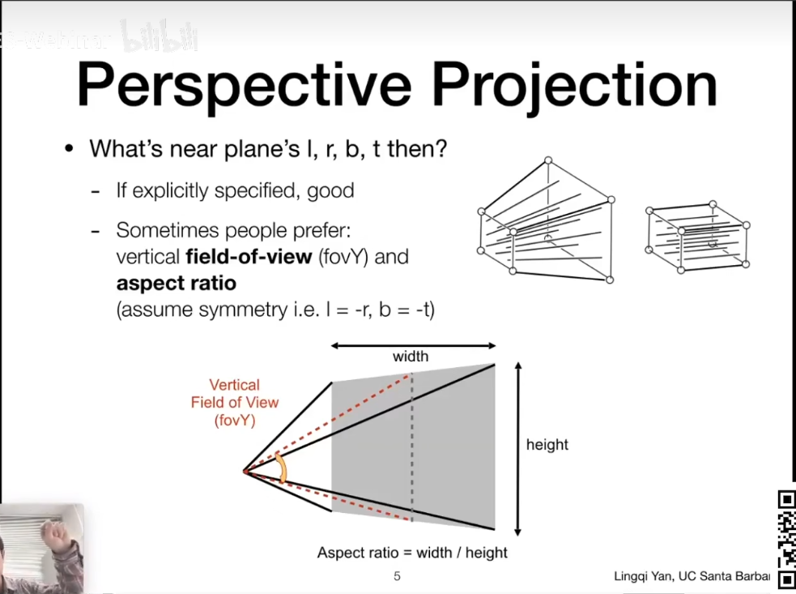

## Perspective

上节课 把透视投影转换成正交投影，已经讲明白了
大家可以看右上方这个示意图
透视投影转换成正交投影 是要保证什么呢？
是要保证： 近处的 和 远处的 两个平面 都是不变的
然后这两个平面的大小 都会变成 和近处的平面一样大的

那么 大家 应该记得， 在正交投影当中， 我们如何定义 
这个三维空间中的长方体呢？
我们用他的:
x轴的range [l-r]
y轴的range [b-t]
z轴的range [n-f]
来表示正方体

既然对于远近(near and far) 透视投影和正交投影都是一样的
咱们就不用管他

在做透视投影的时候 
我们需要把frustum变成cuboid

那么 我们如何定义这么一个frustom呢？

其实简单：
从摄像机出发，
我们给近处的平面 定义一个宽度和高度，
然后定义一个宽高比 aspect ratio

还有一个： Field Of View(fov) 
表示可以看到的角度的范围
分为Horizonal(X)和Vertical(Y)

通过长宽比， fovX and fovY可以相互转化，显然的。

然后，如果已知fovY, 已知aspect_ratio, 已知n的大小
那么就可以求得l,r,b,t

## What's after MVP?

### M = Model transformation(placing objects)
### V = View transformation(placing camera)
### P = Projection transformation
### Orthographic projection(cuboid to "canonical" cube [-1,1] 3  )
